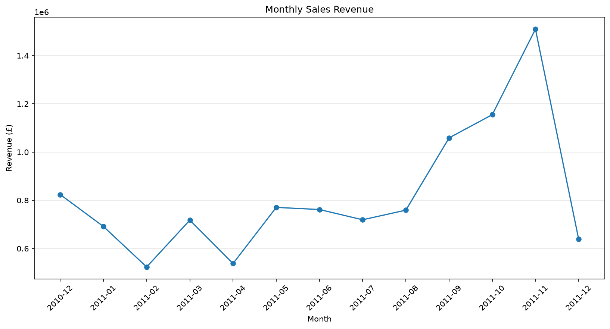
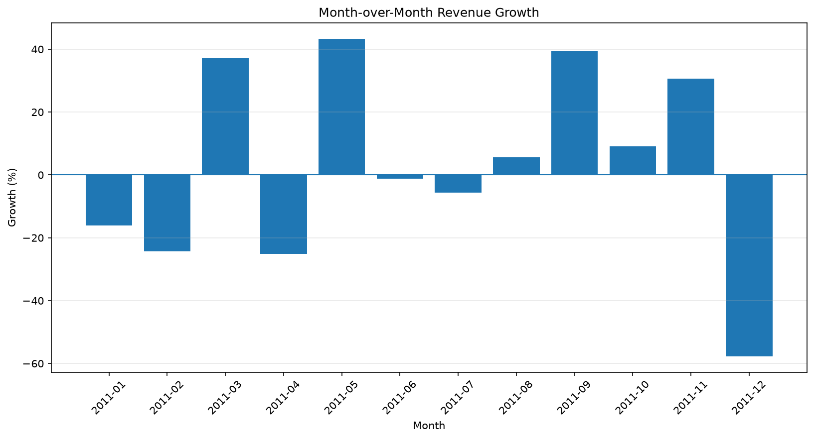
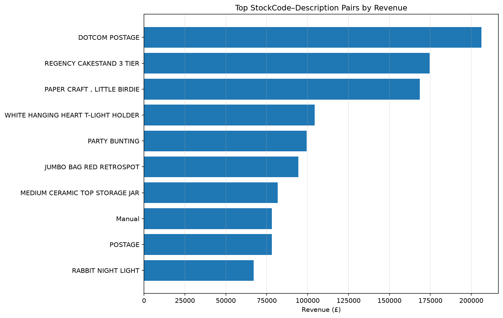
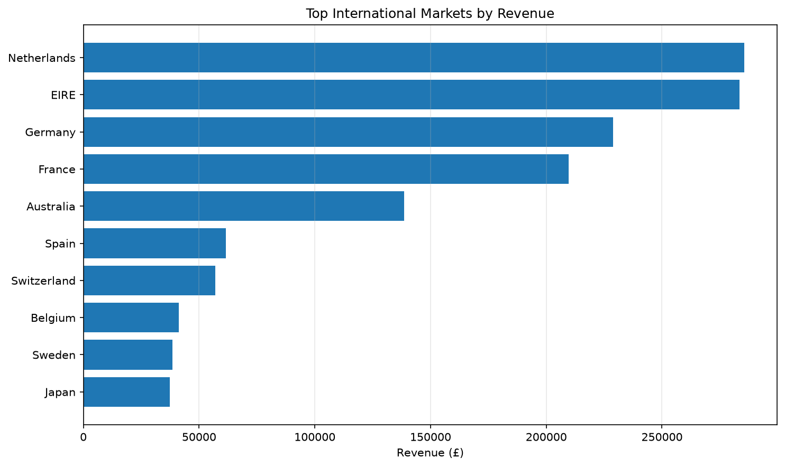
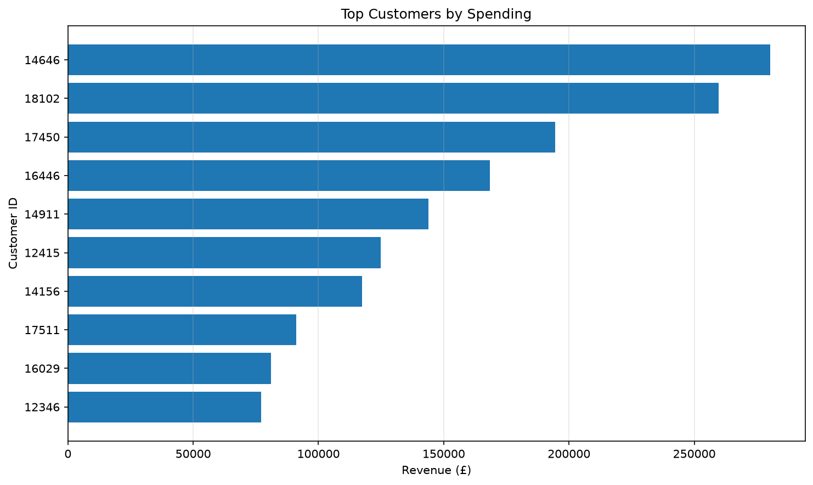
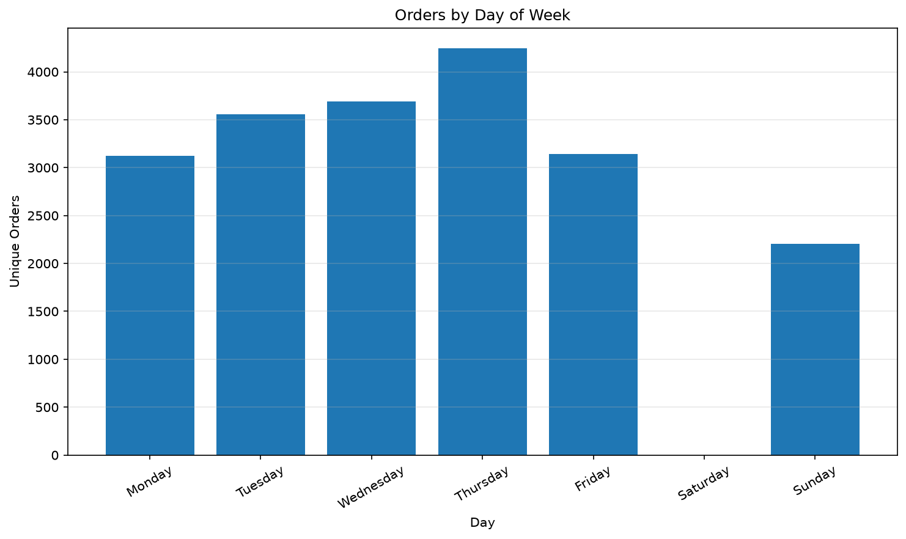
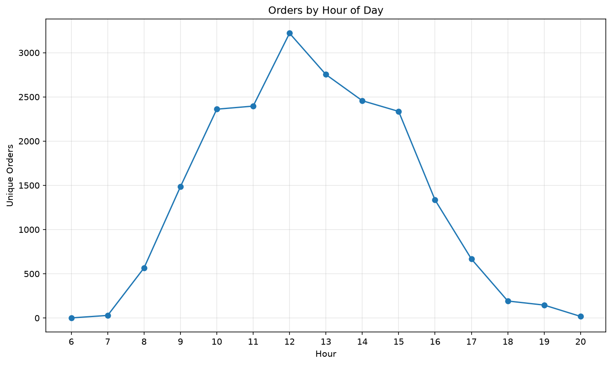
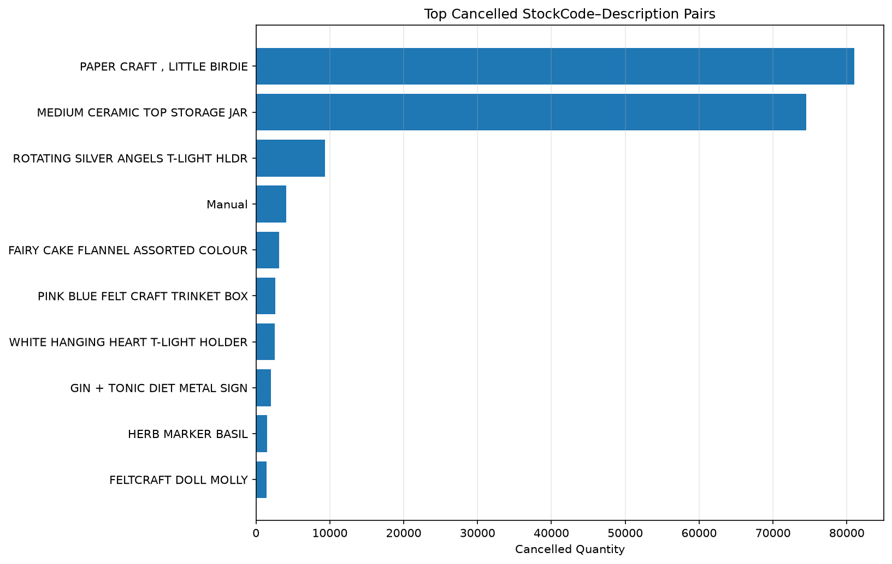

# E-commerce Data Analysis — Final Report

## Executive Summary

This project analyzes 541,909 transaction lines from the UCI Online Retail dataset through a reproducible Python, Pandas, SQLite, SQL, and Matplotlib pipeline.

After applying explicit sales-quality rules, 530,104 transaction lines are classified as valid sales, representing 19,960 unique valid invoice documents and approximately **£10.67 million in revenue**.

The analysis reveals strong geographic concentration in the United Kingdom, substantial seasonal growth during the final months of 2011, high variation in customer purchasing behavior, and a number of unusual product, cancellation, and transaction records that require careful interpretation.

The project intentionally preserves questionable records and represents them through explicit quality flags rather than silently deleting them.

## 1. Dataset

The source dataset contains:

* 541,909 transaction lines;
* 25,900 invoice documents;
* 4,372 identified customers;
* 38 countries.

The data covers:

`2010-12-01` through `2011-12-09`.

December 2011 is therefore incomplete.

## 2. Data Quality

Several important quality issues were identified during exploratory analysis.

The dataset contains 135,080 missing CustomerID values and 1,454 missing product descriptions.

There are 10,624 rows with negative quantities. Of these, 9,288 belong to invoice numbers beginning with `C`, while another 1,336 negative-quantity records do not.

This distinction is important because negative quantity cannot safely be used as a synonym for cancellation.

The dataset also includes:

* 2,515 zero-price records;
* 2 negative-price records;
* 10,147 rows belonging to exact duplicate groups;
* several unusually large quantities and transaction values.

The duplicate sensitivity analysis indicates that duplicate groups potentially affect approximately **0.44% of valid-sales revenue**.

Because no unique transaction-line identifier is provided, duplicate-looking records are flagged rather than automatically removed.

## 3. Analytical Population

General sales analysis uses transactions satisfying all of the following:

* not cancelled;
* positive Quantity;
* positive UnitPrice.

Customer analysis additionally requires CustomerID.

This produces:

| Analytical population |    Rows |
| --------------------- | ------: |
| All transactions      | 541,909 |
| Valid sales           | 530,104 |
| Customer sales        | 397,884 |
| Cancellations         |   9,288 |
| Anomalies             |   2,517 |

## 4. Sales Performance

The valid-sales dataset produces:

* **Total revenue:** £10,666,684.54
* **Valid orders:** 19,960
* **Average Order Value:** £534.40
* **Average revenue per identified customer:** £2,054.27



Monthly sales accelerate strongly in late 2011.

November 2011 produces approximately **£1.51 million**, the highest monthly revenue in the observed period.

September, October, and November collectively show particularly strong business activity.



Month-over-month growth includes:

* March: approximately +37%;
* May: approximately +43%;
* September: approximately +39%;
* November: approximately +31%.

December displays an apparent decline of approximately 58%, but this should not be interpreted as full-month business deterioration because the dataset ends on December 9.

## 5. Product and Transaction Findings



The highest-revenue StockCode–Description pairs include:

* `DOT` — DOTCOM POSTAGE;
* `22423` — REGENCY CAKESTAND 3 TIER;
* `23843` — PAPER CRAFT, LITTLE BIRDIE;
* `85123A` — WHITE HANGING HEART T-LIGHT HOLDER;
* `47566` — PARTY BUNTING.

However, not every StockCode represents merchandise.

Special records include postage, manual adjustments, Amazon fees, carriage, and debt adjustments.

As a result, analyses labelled strictly as “product performance” should either establish a merchandise classification rule or explicitly describe the grouping as StockCode–Description performance.

The dataset also includes extreme transaction quantities.

For example:

* StockCode `23843`: Quantity 80,995;
* StockCode `23166`: Quantity 74,215.

These transactions strongly affect product rankings.

They are retained because the dataset provides insufficient evidence to identify them conclusively as errors.

## 6. Geographic Performance

The United Kingdom dominates revenue generation.

Approximately **84.61% of valid-sales revenue** originates from the UK.

Because of this concentration, international markets are analyzed separately.



The leading international markets are:

1. Netherlands — approximately £285k
2. EIRE — approximately £283k
3. Germany — approximately £229k
4. France — approximately £210k
5. Australia — approximately £139k

The business is therefore heavily dependent on its domestic UK market despite having transactions across 38 countries.

## 7. Customer Analysis



The highest-spending identified customers include:

* Customer 14646 — approximately £280k
* Customer 18102 — approximately £260k
* Customer 17450 — approximately £195k
* Customer 16446 — approximately £168k
* Customer 14911 — approximately £144k

Customer 12748 has the largest number of valid orders at 209, while customer 14911 follows with 201.

The customer-spending and customer-frequency rankings differ significantly.

This demonstrates that order frequency alone does not represent customer value. Some customers place relatively few but exceptionally large orders.

## 8. Ordering Patterns



Thursday has the largest number of valid orders.

Observed unique-order counts include:

* Monday: 3,126
* Tuesday: 3,554
* Wednesday: 3,690
* Thursday: 4,246
* Friday: 3,140
* Sunday: 2,204

No Saturday transactions are present.



Order activity grows rapidly during the morning, peaks around midday, and declines through the afternoon.

The highest observed order count occurs at 12:00 with approximately 3,220 unique invoices.

This suggests that the transaction system primarily records activity during daytime business hours.

## 9. Cancellation Analysis

There are:

* 9,288 cancellation transaction lines;
* 3,836 cancellation invoice documents.

Cancellation documents represent approximately **14.81% of all unique invoice documents**.

This value should be interpreted carefully.

A cancellation document has its own invoice number beginning with `C`, so this metric is a cancellation-document share rather than proof that 14.81% of original customer orders were fully cancelled.



Several StockCodes exhibit extremely large cancelled quantities, particularly:

* `23843`
* `23166`

The cancellation value measured using absolute cancelled transaction revenue is approximately **£896,812**.

## 10. Pandas and SQL Validation

The project performs the same core business analysis through both Pandas and SQLite.

Examples include:

* total revenue;
* order count;
* Average Order Value;
* monthly revenue;
* customer ranking;
* country ranking;
* weekday analysis;
* cancellation analysis.

The SQLite database contains:

* transactions;
* customers;
* products;
* valid_sales view;
* customer_sales view;
* cancellations view;
* anomalies view.

Pandas and SQL outputs are validated against one another during database construction.

This reduces the risk of inconsistent business definitions between analysis implementations.

## 11. Technical Validation

The project contains automated tests for:

* validation;
* cleaning;
* feature engineering;
* analytical views;
* business analysis;
* database generation;
* SQL execution;
* visualization.

Final test status:

```text
64 passed
```

## 12. Limitations

The analysis has several important limitations.

### Partial December 2011

Data ends on December 9, so December revenue and month-over-month growth are not comparable with full months.

### Missing Customer Identification

A substantial portion of transaction lines lacks CustomerID.

These records remain usable for general sales analysis but cannot participate in identified-customer analysis.

### Ambiguous Duplicate Records

Exact duplicate-looking lines exist, but no unique line identifier is provided.

It is therefore impossible to prove whether every repeated row is a duplicate entry or a legitimate repeated transaction line.

### Special StockCodes

StockCodes can represent non-merchandise records such as postage, fees, manual adjustments, and accounting records.

A reliable merchandise/non-merchandise taxonomy would require additional business metadata.

### Extreme Transactions

Several unusually large quantities and revenue values substantially influence rankings.

They are preserved because available evidence is insufficient to classify them as invalid.

## 13. Conclusion

The analysis demonstrates that the retailer generated approximately £10.67 million in valid-sales revenue during the observed period, with revenue highly concentrated in the United Kingdom and strongly increasing during the final complete months of 2011.

Customer behavior is heterogeneous: the highest-frequency customers are not always the highest-value customers, and several large transactions significantly affect both product and customer rankings.

The project also shows why business analysis should not begin directly from raw transaction data. Explicit data-quality flags, analytical populations, reproducible business definitions, and consistency checks between Pandas and SQL are necessary before drawing conclusions from the dataset.
